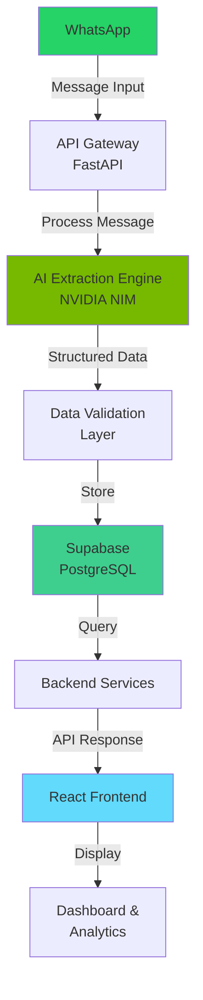
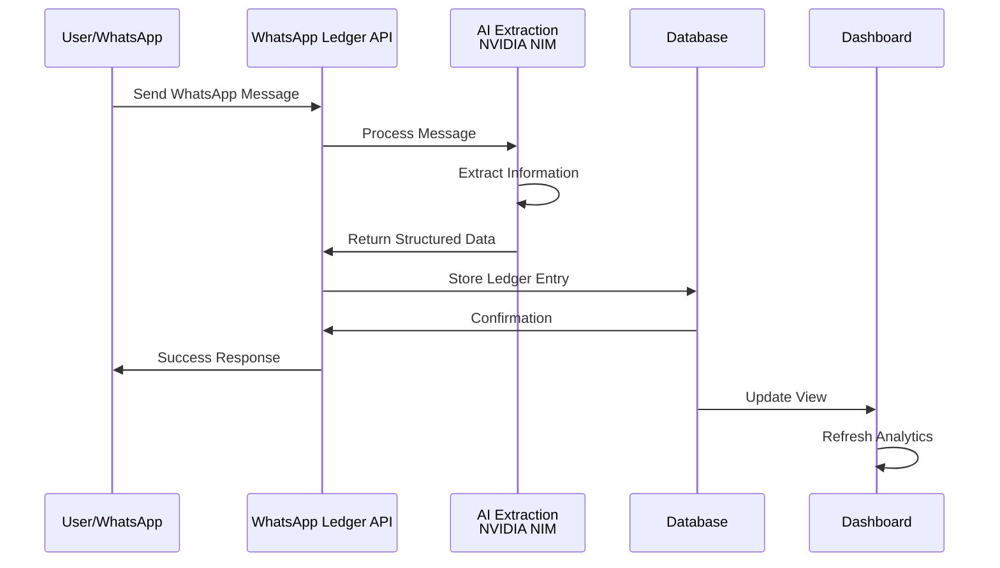

# WhatsApp Ledger

[](https://github.com/Ayush0090-BD/WHATSLEGD/stargazers)
[](LICENSE)
[](https://www.python.org/)
[](https://react.dev/)

> **Your Business Memory Inside WhatsApp**

WhatsApp Ledger is an AI-powered business ledger designed for micro-businesses that already operate through WhatsApp. Convert natural language business conversations into structured, actionable records effortlessly.


---

## Table of Contents

- [Problem Statement](#problem-statement)
- [Solution](#solution)
- [Key Features](#key-features)
- [Architecture](#architecture)
- [Tech Stack](#tech-stack)
- [System Workflow](#system-workflow)
- [Getting Started](#getting-started)
- [Environment Variables](#environment-variables)
- [API Documentation](#api-documentation)
- [Database Schema](#database-schema)
- [Project Structure](#project-structure)
- [Screenshots](#screenshots)
- [Roadmap](#roadmap)
- [Contributing](#contributing)
- [License](#license)
- [Acknowledgements](#acknowledgements)

---

## Problem Statement

**For micro-businesses that operate via WhatsApp:**

- 📱 Most communication happens on WhatsApp, but business records are scattered
- 📝 Manual record-keeping is tedious and error-prone
- 💰 Tracking customers, payments, and dues is a constant struggle
- 🔔 Following up with customers requires juggling multiple notes
- 📊 No visibility into business health and performance metrics
- 💼 Traditional CRM systems are too complex and expensive

Small business owners like plumbers, electricians, tutors, and repair technicians waste hours managing scattered information when they should be focusing on growing their business.

---

## Solution

WhatsApp Ledger leverages AI to automatically extract business information from natural language WhatsApp messages and convert them into structured ledger records.

**Example:**

```
WhatsApp Message:
"Done AC repair for Raju. Total ₹700. Paid ₹500. Remaining ₹200. Call him next week."

Extracted Data:
{
  "customer": "Raju",
  "service": "AC repair",
  "total_amount": 700,
  "paid_amount": 500,
  "due_amount": 200,
  "status": "partial_payment",
  "follow_up": "2024-06-27"
}
```

The AI automatically parses conversations, extracts relevant data, and stores it in a structured ledger accessible through an intuitive dashboard.

---

## Key Features

✨ **AI-Powered Extraction**
- Natural language processing for automatic data extraction
- Supports multiple languages and informal conversations
- High accuracy transaction parsing

💳 **Customer & Payment Management**
- Customer profiles with transaction history
- Payment tracking (paid/pending/partial)
- Outstanding dues monitoring
- Payment reminder system

📊 **Analytics Dashboard**
- Revenue overview and trends
- Customer metrics and insights
- Outstanding dues summary
- Transaction history with filters

🔔 **Smart Follow-ups**
- Automated reminder scheduling
- Customer communication tracking
- Task management for business activities

📱 **Mobile-First Design**
- Responsive interface for all devices
- Quick message entry
- Real-time updates

🔒 **Secure & Private**
- Data encryption at rest and in transit
- Customer data privacy compliance
- Secure authentication

---

## Architecture



---

## Tech Stack

| Layer | Technology | Purpose |
|-------|-----------|---------|
| **Frontend** | React 18+ | UI framework |
| | TailwindCSS | Styling & responsive design |
| | Vite | Build tool & bundler |
| **Backend** | FastAPI | REST API framework |
| | Python 3.9+ | Server-side language |
| **AI/ML** | NVIDIA NIM | LLM inference & extraction |
| **Database** | Supabase (PostgreSQL) | Data storage |
| | PostgREST | Auto-generated APIs |
| **Deployment** | Vercel | Frontend hosting |
| | Render | Backend hosting |
| | Supabase Cloud | Database hosting |
| **Additional** | Pydantic | Data validation |
| | CORS | Cross-origin handling |

---

## System Workflow



---

## Getting Started

### Prerequisites

- Node.js 16+ and npm/yarn
- Python 3.9+
- Git
- A Supabase account (free tier available)
- NVIDIA NIM API key

### Installation

#### 1. Clone the Repository

```bash
git clone https://github.com/Ayush0090-BD/WHATSLEGD.git
cd WHATSLEGD
```

#### 2. Backend Setup

```bash
# Navigate to backend directory
cd backend

# Create virtual environment
python -m venv venv

# Activate virtual environment
# On Windows:
venv\Scripts\activate
# On macOS/Linux:
source venv/bin/activate

# Install dependencies
pip install -r requirements.txt

# Create .env file (see Environment Variables section)
cp .env.example .env

# Update .env with your credentials
nano .env

# Run migrations (if applicable)
python -m alembic upgrade head

# Start the backend server
uvicorn server:app --reload --host 0.0.0.0 --port 8000
```

Backend will be available at: `http://localhost:8000`

#### 3. Frontend Setup

```bash
# Navigate to frontend directory
cd frontend

# Install dependencies
npm install

# Create .env file
cp .env.example .env.local

# Update .env.local with API endpoint
nano .env.local

# Start development server
npm run dev
```

Frontend will be available at: `http://localhost:5173`

#### 4. Database Setup

```bash
# Use Supabase UI at https://supabase.com

# Or run SQL migrations:
psql -h [SUPABASE_HOST] -U postgres -d postgres -f migrations/schema.sql
```

---

## Environment Variables

### Backend (.env)

```env
# FastAPI Configuration
DEBUG=True
ENV=development

# NVIDIA NIM
NVIDIA_API_KEY=your_nvidia_api_key_here
NVIDIA_API_BASE_URL=https://integrate.api.nvidia.com

# Supabase
SUPABASE_URL=https://your-project.supabase.co
SUPABASE_KEY=your_anon_key_here
SUPABASE_SERVICE_ROLE_KEY=your_service_role_key_here

# JWT
JWT_SECRET=your_jwt_secret_key_here
JWT_ALGORITHM=HS256

# CORS
CORS_ORIGINS=["http://localhost:5173", "https://yourdomain.com"]

# Server
PORT=8000
HOST=0.0.0.0
```

### Frontend (.env.local)

```env
VITE_API_URL=http://localhost:8000
VITE_SUPABASE_URL=https://your-project.supabase.co
VITE_SUPABASE_KEY=your_anon_key_here
VITE_APP_NAME=WhatsApp Ledger
```

---

## API Documentation

### Base URL

```
http://localhost:8000/api/v1
```

### Authentication

All endpoints require Bearer token authentication.

```
Authorization: Bearer <your_jwt_token>
```

---

### 1. Extract Transaction from Message

**Endpoint:** `POST /extract`

**Description:** Extract structured transaction data from natural language message

**Request:**

```bash
curl -X POST "http://localhost:8000/api/v1/extract" \
  -H "Content-Type: application/json" \
  -H "Authorization: Bearer YOUR_TOKEN" \
  -d '{
    "message": "Done AC repair for Raju. Total ₹700. Paid ₹500. Remaining ₹200. Call him next week."
  }'
```

**Response:**

```json
{
  "success": true,
  "data": {
    "customer_name": "Raju",
    "service_type": "AC repair",
    "total_amount": 700,
    "paid_amount": 500,
    "due_amount": 200,
    "payment_status": "partial",
    "follow_up_date": "2024-06-27",
    "notes": "",
    "confidence_score": 0.95
  },
  "extracted_at": "2024-06-20T10:30:00Z"
}
```

---

### 2. Create Ledger Entry

**Endpoint:** `POST /ledger`

**Description:** Create a new transaction ledger entry

**Request:**

```bash
curl -X POST "http://localhost:8000/api/v1/ledger" \
  -H "Content-Type: application/json" \
  -H "Authorization: Bearer YOUR_TOKEN" \
  -d '{
    "customer_id": "cust_123",
    "service_type": "AC repair",
    "total_amount": 700,
    "paid_amount": 500,
    "due_amount": 200,
    "payment_status": "partial",
    "follow_up_date": "2024-06-27",
    "notes": "Part payment received"
  }'
```

**Response:**

```json
{
  "success": true,
  "data": {
    "id": "ledger_456",
    "customer_id": "cust_123",
    "service_type": "AC repair",
    "total_amount": 700,
    "paid_amount": 500,
    "due_amount": 200,
    "payment_status": "partial",
    "follow_up_date": "2024-06-27",
    "created_at": "2024-06-20T10:30:00Z",
    "updated_at": "2024-06-20T10:30:00Z"
  }
}
```

---

### 3. Get Ledger Entries

**Endpoint:** `GET /ledger?customer_id=cust_123&limit=10&offset=0`

**Description:** Retrieve ledger entries with filtering and pagination

**Request:**

```bash
curl -X GET "http://localhost:8000/api/v1/ledger?customer_id=cust_123&limit=10" \
  -H "Authorization: Bearer YOUR_TOKEN"
```

**Response:**

```json
{
  "success": true,
  "data": [
    {
      "id": "ledger_456",
      "customer_id": "cust_123",
      "customer_name": "Raju",
      "service_type": "AC repair",
      "total_amount": 700,
      "paid_amount": 500,
      "due_amount": 200,
      "payment_status": "partial",
      "created_at": "2024-06-20T10:30:00Z"
    }
  ],
  "total": 1,
  "limit": 10,
  "offset": 0
}
```

---

### 4. Get Analytics

**Endpoint:** `GET /analytics?period=monthly`

**Description:** Get business analytics and metrics

**Request:**

```bash
curl -X GET "http://localhost:8000/api/v1/analytics?period=monthly" \
  -H "Authorization: Bearer YOUR_TOKEN"
```

**Response:**

```json
{
  "success": true,
  "data": {
    "period": "monthly",
    "total_revenue": 50000,
    "total_transactions": 25,
    "total_customers": 12,
    "outstanding_dues": 15000,
    "paid_amount": 35000,
    "average_transaction": 2000,
    "payment_completion_rate": 0.70,
    "trends": {
      "daily_revenue": [
        { "date": "2024-06-01", "amount": 2000 },
        { "date": "2024-06-02", "amount": 1500 }
      ]
    }
  }
}
```

---

### Error Responses

**400 Bad Request:**

```json
{
  "success": false,
  "error": "Invalid message format",
  "details": "Message field is required"
}
```

**401 Unauthorized:**

```json
{
  "success": false,
  "error": "Invalid or expired token"
}
```

**500 Internal Server Error:**

```json
{
  "success": false,
  "error": "Failed to process request",
  "details": "Error details for debugging"
}
```

---

## Database Schema

### Customers Table

```sql
CREATE TABLE customers (
  id UUID PRIMARY KEY DEFAULT gen_random_uuid(),
  user_id UUID NOT NULL REFERENCES auth.users(id),
  name VARCHAR(255) NOT NULL,
  phone VARCHAR(20),
  email VARCHAR(255),
  address TEXT,
  city VARCHAR(100),
  created_at TIMESTAMP DEFAULT CURRENT_TIMESTAMP,
  updated_at TIMESTAMP DEFAULT CURRENT_TIMESTAMP
);
```

### Ledger Entries Table

```sql
CREATE TABLE ledger (
  id UUID PRIMARY KEY DEFAULT gen_random_uuid(),
  user_id UUID NOT NULL REFERENCES auth.users(id),
  customer_id UUID NOT NULL REFERENCES customers(id),
  service_type VARCHAR(255),
  total_amount DECIMAL(10, 2) NOT NULL,
  paid_amount DECIMAL(10, 2) DEFAULT 0,
  due_amount DECIMAL(10, 2),
  payment_status VARCHAR(50) DEFAULT 'pending',
  follow_up_date DATE,
  notes TEXT,
  source VARCHAR(50) DEFAULT 'manual',
  created_at TIMESTAMP DEFAULT CURRENT_TIMESTAMP,
  updated_at TIMESTAMP DEFAULT CURRENT_TIMESTAMP,
  CONSTRAINT valid_amounts CHECK (paid_amount >= 0 AND due_amount >= 0)
);
```

### Payments Table

```sql
CREATE TABLE payments (
  id UUID PRIMARY KEY DEFAULT gen_random_uuid(),
  ledger_id UUID NOT NULL REFERENCES ledger(id),
  amount DECIMAL(10, 2) NOT NULL,
  payment_method VARCHAR(50),
  payment_date TIMESTAMP DEFAULT CURRENT_TIMESTAMP,
  notes TEXT,
  created_at TIMESTAMP DEFAULT CURRENT_TIMESTAMP
);
```

### Follow-ups Table

```sql
CREATE TABLE follow_ups (
  id UUID PRIMARY KEY DEFAULT gen_random_uuid(),
  ledger_id UUID NOT NULL REFERENCES ledger(id),
  scheduled_date DATE NOT NULL,
  status VARCHAR(50) DEFAULT 'pending',
  completed_at TIMESTAMP,
  notes TEXT,
  created_at TIMESTAMP DEFAULT CURRENT_TIMESTAMP
);
```

### Analytics View

```sql
CREATE VIEW customer_analytics AS
SELECT 
  c.id,
  c.name,
  COUNT(l.id) as transaction_count,
  SUM(l.total_amount) as total_spent,
  SUM(l.paid_amount) as total_paid,
  SUM(l.due_amount) as outstanding_dues,
  MAX(l.created_at) as last_transaction
FROM customers c
LEFT JOIN ledger l ON c.id = l.customer_id
GROUP BY c.id, c.name;
```

---

## Project Structure

```
WHATSLEGD/
├── frontend/                     # React Frontend
│   ├── src/
│   │   ├── components/          # Reusable React components
│   │   │   ├── Dashboard/       # Main dashboard
│   │   │   ├── Ledger/          # Ledger management
│   │   │   ├── Analytics/       # Analytics dashboard
│   │   │   └── Common/          # Common UI components
│   │   ├── pages/               # Page components
│   │   ├── hooks/               # Custom React hooks
│   │   ├── services/            # API service layer
│   │   ├── utils/               # Utility functions
│   │   ├── styles/              # Global styles
│   │   └── App.tsx              # Root component
│   ├── public/                  # Static assets
│   ├── vite.config.ts           # Vite configuration
│   ├── tsconfig.json            # TypeScript config
│   ├── tailwind.config.js        # TailwindCSS config
│   └── package.json             # Dependencies
│
├── backend/                      # FastAPI Backend
│   ├── app/
│   │   ├── main.py              # Application entry point
│   │   ├── routes/
│   │   │   ├── extract.py       # Extraction endpoints
│   │   │   ├── ledger.py        # Ledger endpoints
│   │   │   └── analytics.py     # Analytics endpoints
│   │   ├── models/
│   │   │   ├── schemas.py       # Pydantic schemas
│   │   │   └── database.py      # Database models
│   │   ├── services/
│   │   │   ├── ai_service.py    # AI extraction logic
│   │   │   ├── ledger_service.py # Ledger operations
│   │   │   └── analytics_service.py
│   │   ├── auth/
│   │   │   └── jwt.py           # JWT authentication
│   │   ├── db/
│   │   │   └── database.py      # Database connection
│   │   └── config.py            # Configuration
│   ├── migrations/              # Database migrations
│   ├── requirements.txt         # Python dependencies
│   ├── .env.example             # Environment variables template
│   └── server.ts                # Server start script
│
├── assets/                      # Images and media
├── data/                        # Data files
├── migrations/                  # Database migrations
├── README.md                    # This file
├── .gitignore
├── .env.example
├── tsconfig.json
├── vite.config.ts
├── metadata.json
└── package.json
```

---

## Screenshots

### Dashboard

*Main dashboard showing revenue overview and key metrics*

### Ledger Management

*Customer ledger with transaction history and payment tracking*

### AI Extraction

*Natural language message being processed and structured*

### Analytics

*Detailed analytics with trends and business insights*

---

## Roadmap

### Phase 1: MVP (Current)
- ✅ AI-powered message extraction
- ✅ Customer ledger management
- ✅ Payment tracking
- ✅ Basic analytics dashboard
- ✅ Web interface

### Phase 2: WhatsApp Integration
- 📱 Direct WhatsApp API integration
- 📨 Automatic message ingestion
- 🔔 WhatsApp notifications for reminders
- 💬 Two-way messaging

### Phase 3: Voice Notes Support
- 🎙️ Voice message transcription
- 🔍 Audio extraction and processing
- 📝 Automatic transcription to text

### Phase 4: Invoice Generation
- 📄 Automatic invoice creation
- 💾 Invoice templates
- 📧 Email delivery
- 📱 WhatsApp sharing

### Phase 5: Payment Collection
- 💳 Online payment gateway integration
- 🔗 Payment links
- ✅ Automated payment verification
- 📊 Payment status sync

---

## Contributing

We welcome contributions from the community! Here's how you can help:

### Getting Started

1. Fork the repository
2. Create your feature branch (`git checkout -b feature/amazing-feature`)
3. Commit your changes (`git commit -m 'Add amazing feature'`)
4. Push to the branch (`git push origin feature/amazing-feature`)
5. Open a Pull Request

### Development Guidelines

- Follow PEP 8 for Python code
- Use TypeScript for frontend code
- Write clear commit messages
- Include tests for new features
- Update documentation as needed

### Reporting Issues

- Use GitHub Issues for bug reports
- Include steps to reproduce
- Provide screenshots for UI issues
- Include environment details

### Code of Conduct

Please note that this project is released with a [Contributor Code of Conduct](CODE_OF_CONDUCT.md). By participating in this project you agree to abide by its terms.

---

## License

This project is licensed under the MIT License - see the [LICENSE](LICENSE) file for details.

---

## Acknowledgements

- [NVIDIA NIM](https://ai.nvidia.com/) for AI inference capabilities
- [Supabase](https://supabase.com/) for database and authentication
- [FastAPI](https://fastapi.tiangolo.com/) for the backend framework
- [React](https://react.dev/) for the frontend library
- [TailwindCSS](https://tailwindcss.com/) for styling
- All contributors and community members

---

## Support

For support, email support@whatappledger.com or open an issue on GitHub.

---

**Built with ❤️ for micro-businesses**

[⬆ back to top](#whatsapp-ledger)
